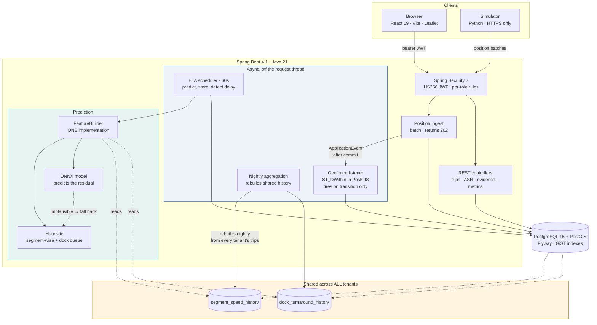
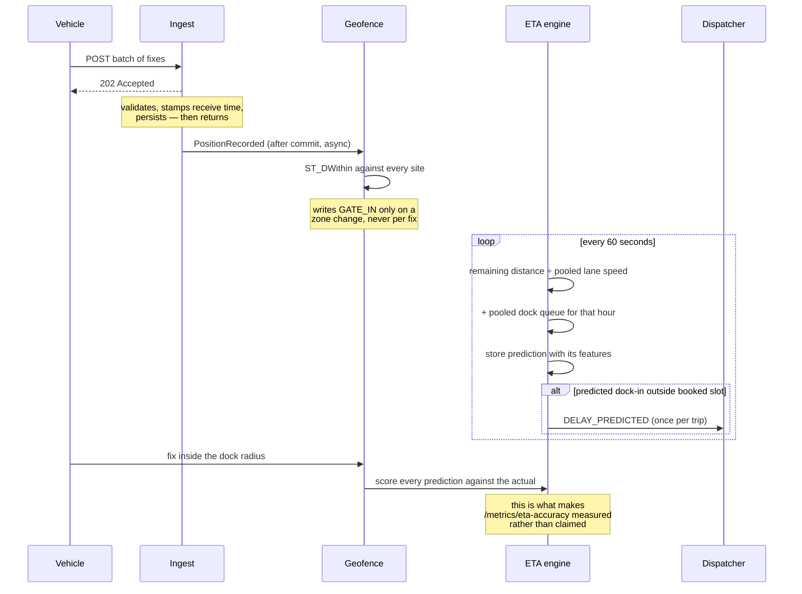

# Drishya

**Real-time transport visibility for vendors delivering into marketplace fulfilment centres.**

A vendor dispatching goods into a fulfilment centre has no visibility of the
vehicle between the gate at their warehouse and the gate at the destination.
They discover a delay when the delivery is refused, and they discover a
documentation error weeks later on a payment statement, with the dispute window
already closing.

Drishya closes both gaps while they can still be acted on: it predicts **dock-in
time** — not gate arrival — and it validates the paperwork **before dispatch**.

### Why a cluster

One fulfilment centre draws inbound from many vendors, most too small to build
this alone. Lane speeds and dock queue depths are **pooled across every tenant**,
so prediction accuracy improves as the cluster grows. Consignment data stays
strictly per tenant; what is shared is only how long the road took, which
identifies nobody. A single-vendor tracker cannot reproduce this at any level of
engineering effort — it simply has fewer observations of the same road.

---

## Running it

Everything, in one command:

```bash
docker compose up --build
```

| | |
|---|---|
| Frontend | http://localhost:5173 |
| API | http://localhost:8080 |
| Swagger UI | http://localhost:8080/swagger-ui.html |

Nothing reaches outside the machine except OpenStreetMap tiles.

For development, with hot reload:

```bash
docker compose up -d db                                    # PostgreSQL 16 + PostGIS
cd Drishya.Backend && ./mvnw spring-boot:run               # :8080
cd "Drishya Frontend/drishya_frontend" && npm run dev      # :5173
```

Start the backend first — Vite proxies `/api` to it, so the browser stays on one
origin and CORS never comes into it.

### Demo accounts

Password `drishya` for all of them; the login screen has one-click buttons.

| Role | Email |
|---|---|
| Vendor admin | `priya@anandauto.example` |
| Dispatcher | `arjun@nimbustextiles.example` |
| Driver | `ramesh@fleet.example` |
| Fulfilment centre | `imran@fcbhiwandi.example` |

### Watching a vehicle move

The simulator is the only thing that produces `SIMULATED` positions. Hardware is
out of scope; there is no firmware and no MQTT.

```bash
pip install -r simulator/requirements.txt
python simulator/simulate.py --shipment SHP-24025 --time-scale 120
```

A six-hour run replays in three minutes, with a traffic stall and a network
dead zone where fixes are still *taken* but not *sent* until coverage returns.
`--vehicles 4` puts four trucks on the lane at once.

---

## Architecture



The amber box is the differentiator. Everything else is a competent tracker.

### The prediction chain



---

## API surface

Bearer JWT on everything except the auth and documentation paths. Full reference
at `/swagger-ui.html`; the highlights:

### Trips and ingest

| | |
|---|---|
| `POST /api/v1/trips/{id}/positions` | Batch ingest. **202**, partial acceptance with per-fix rejection reasons |
| `POST /api/v1/trips/from-shipment/{id}` | Dispatch. Refuses while documents are outstanding |
| `GET /api/v1/trips/active` | Live trips with predicted dock-in, booked slot and risk state |
| `GET /api/v1/trips/{id}/positions` | The driven trace, in device-time order |

### Compliance

| | |
|---|---|
| `POST /api/v1/shipments/{id}/asn/check` | Validate without committing |
| `POST /api/v1/shipments/{id}/asn` | Submit. **200 with the failures** — a rejection is a successful validation with a negative answer |
| `GET /api/v1/shipments/{id}/evidence-pack` | The chargeback dispute artefact |
| `GET /api/v1/exceptions` | Predicted delays and rejected notices |

### Prediction

| | |
|---|---|
| `GET /api/v1/metrics/eta-accuracy` | Mean **absolute** error, overall and per lane |
| `GET /api/v1/internal/training-data` | CSV export, service-token protected |

---

## Decisions worth knowing

**Timestamps are epoch milliseconds, never ISO strings.** The browser does date
arithmetic on them directly. `service/Mapper.java` is the only place that
converts; nothing hands an `Instant` to Jackson.

**Every enum carries an explicit wire value** (`at_gate`, `docs_pending`,
`simulated`) matching `src/lib/constants.js` exactly. Renaming a Java constant
is safe; changing a wire value breaks the browser silently.

**`promisedAt` and `predictedAt` are both kept.** One is what was agreed at
booking and never moves; the other is what the platform now believes. The gap
between them is the entire product.

**Spatial work happens in PostGIS**, never a hand-rolled Haversine. The database
has the spheroid, the GiST index and one implementation of the question.

**Every position records its source.** A fix from the simulator and one from a
driver's browser carry different evidentiary weight, and the evidence pack
counts them separately rather than blending them into one number.

**Scorecards, alerts and exceptions are derived on read**, never stored. A
stored percentage that can drift from the shipments it summarises is worse than
not having one.

**Isolation is enforced in the service layer, on reads and writes alike.**
Vendor by tenant, fulfilment centre by site, driver by the shipments on their
vehicle — and anything unrecognised gets nothing rather than everything. A
`vendorId` or `fcId` in a query string is something the browser *asks for*, never
the boundary; the scope is applied first, from the token, and the caller's own
filters only narrow a set that was already theirs.

**Predictions have a shelf life.** No estimate is served from a position fix
older than two hours, and a trip silent for a day is closed as ABANDONED. A
system with no way to say "I have lost this vehicle" will express ignorance in
the language of precision — this one reported a consignment 85 hours late, from
arithmetic that was correct at every step.

**The ETA model predicts the residual of the heuristic**, not the arrival time.
It has far less to learn, and when it has learned nothing useful it predicts a
correction near zero and degrades to the heuristic rather than to noise.

---

## Testing

Four layers, because on this project each one repeatedly passed while the layer
above it was broken.

```bash
# 79 assertions end to end, both servers up. Safe to re-run.
bash Drishya.Backend/scripts/api-smoke-test.sh

# every write path, attempted as the wrong tenant. Every line must say "blocked".
python Drishya.Backend/scripts/tenant-write-audit.py

# all 39 pages, in a real browser, as every role
node Drishya.Backend/scripts/ui-smoke.mjs

# 26 interaction journeys: paperwork rejected then corrected, dispatch blocked
# then allowed, evidence pack downloaded, proof of delivery signed
node Drishya.Backend/scripts/ui-journeys.mjs

# real PostGIS via Testcontainers — H2 cannot answer ST_DWithin
cd Drishya.Backend && ./mvnw test
```

**Why four.** `curl` proved the API healthy on a day the browser could not sign
in at all. A single-tenant API test proved isolation while seven endpoints
leaked across tenants. A page-render check reported 39/39 clean while every page
had rendered the login screen. Each layer only sees faults at its own layer, so
the suites assert against their own known failure modes: `ui-smoke` fails if a
whole portal renders identical content, or if a map collapses to zero height;
`api-smoke-test` signs in as two vendors and asserts their data does not
intersect.

**A 4xx is not proof of anything.** A malformed body is rejected before
authorisation runs. Every probe in these scripts uses a well-formed one.

## The machine-learning pipeline

```bash
cd ml && pip install -r requirements.txt

# Before real trips exist
python generate_synthetic_trips.py --rows 4000
python train.py --csv data/synthetic.csv --synthetic

# From a running system
curl -H "X-Service-Token: $INTERNAL_SERVICE_TOKEN" \
     http://localhost:8080/api/v1/internal/training-data > data/training.csv
python train.py --csv data/training.csv
```

> **Synthetic data is labelled as such, everywhere.** `--synthetic` records
> `trainedOnSyntheticData: true` in `models/features.json`; the backend logs a
> warning on load and the API reports the flag, so the accuracy panel in the UI
> says so out loud. An accuracy figure measured on generated data describes the
> generator, not the road, and must never be presented as validated performance.

Feature order is recorded at training time and **verified at load**. A mismatch
throws nothing on its own — the model reads each feature out of the wrong slot
and returns a plausible number that is quietly wrong forever — so the loader
refuses to start rather than serve it.

---

## Deployment

Render (backend) · Vercel (frontend) · Neon (Postgres with PostGIS). See
**[DEPLOYMENT.md](DEPLOYMENT.md)**.

> The deployment configuration is written and has been verified by building and
> running the container locally, but it has **not been deployed** — those
> accounts do not exist yet. Treat the first deploy as debugging.

---

## Scope

**Hardware is out of scope.** GPS is simulated, ingest is HTTPS only, and there
is no firmware, MQTT or socket code anywhere.

**No Kafka, Kubernetes or service mesh.** At this volume a Spring
`ApplicationEvent` and a scheduled job do the same work with none of the
operational surface. If ingest grew past what one instance can absorb, the queue
would go between `PositionIngestService` and `GeofenceListener` — that seam is
already an event boundary, which is most of the work.

**No paid APIs.** Map tiles are OpenStreetMap raster.
